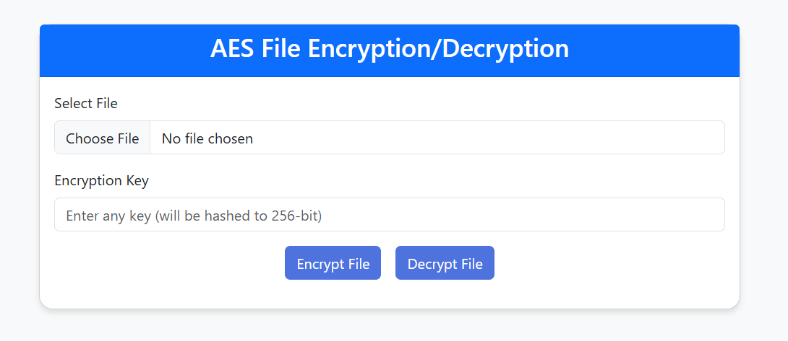

# thuatToanAES
xây dựng trang web sử dụng thuật toán AES Mã hóa file

        
    

<h2 align="center">
    <a href="https://dainam.edu.vn/vi/khoa-cong-nghe-thong-tin">
    🎓 Faculty of Information Technology (DaiNam University)
    </a>
</h2>
 
<h2 align="center">
   CRYPTOGRAPHY AND CYBER SECURITY
</h2>
 

    

        
        
        
    

